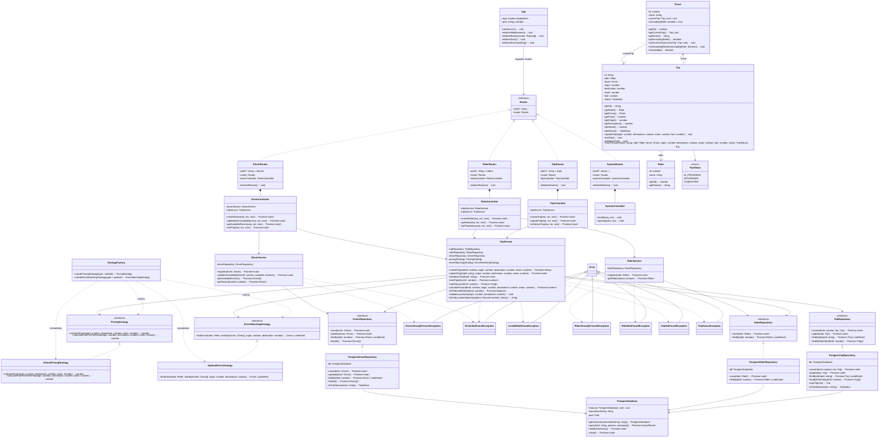

# Class Diagram

```mermaid
classDiagram
    class App {
        +app: express.Application
        +port: string | number
        +startServer(): void
        -initializeMiddlewares(): void
        -initializeRoutes(routes: Routes[]): void
        -initializeDocs(): void
        -initializeErrorHandling(): void
    }

    class Routes {
        <<interface>>
        +path?: string
        +router: Router
    }

    class DriverRoutes {
        +path?: string = /drivers
        +router: Router
        -driverController: DriverController
        -initializeRoutes(): void
    }

    class RiderRoutes {
        +path?: string = /riders
        +router: Router
        -riderController: RiderController
        -initializeRoutes(): void
    }

    class TripRoutes {
        +path?: string = /trips
        +router: Router
        -tripController: TripController
        -initializeRoutes(): void
    }

    class SystemRoutes {
        +path?: string = /
        +router: Router
        -systemController: SystemController
        -initializeRoutes(): void
    }

    class DriverController {
        -driverService: DriverService
        -tripService: TripService
        +createDriver(req, res, next): Promise~void~
        +updateDriverAvailability(req, res, next): Promise~void~
        +getAvailableDrivers(req, res, next): Promise~void~
        +endTrip(req, res, next): Promise~void~
    }

    class RiderController {
        -riderService: RiderService
        -tripService: TripService
        +createRider(req, res, next): Promise~void~
        +getRider(req, res, next): Promise~void~
        +getTripHistory(req, res, next): Promise~void~
    }

    class TripController {
        -tripService: TripService
        +createTrip(req, res, next): Promise~void~
        +updateTrip(req, res, next): Promise~void~
        +withdrawTrip(req, res, next): Promise~void~
    }

    class SystemController {
        +health(req, res): void
        +openApi(req, res): void
    }

    class DriverService {
        -driverRepository: DriverRepository
        +register(driver: Driver): Promise~void~
        +updateAvailability(driverId: number, available: boolean): Promise~void~
        +getAvailableDrivers(): Promise~Driver[]~
        +getDriver(driverId: number): Promise~Driver~
    }

    class RiderService {
        -riderRepository: RiderRepository
        +register(rider: Rider): Promise~void~
        +getRider(riderId: number): Promise~Rider~
    }

    class TripService {
        -tripRepository: TripRepository
        -riderRepository: RiderRepository
        -driverRepository: DriverRepository
        -pricingStrategy: PricingStrategy
        -driverMatchingStrategy: DriverMatchingStrategy
        +createTrip(riderId: number, origin: number, destination: number, seats: number): Promise~string~
        +updateTrip(tripId: string, origin: number, destination: number, seats: number): Promise~void~
        +withdrawTrip(tripId: string): Promise~void~
        +endTrip(driverId: number): Promise~number~
        +tripHistory(riderId: number): Promise~Trip[]~
        -calculateFare(riderId: number, origin: number, destination: number, seats: number): Promise~number~
        -isPreferredRider(riderId: number): Promise~boolean~
        -validateLocations(origin: number, destination: number): void
        -formatLocationOptions(options: Record~number, string~): string
    }

    class StrategyFactory {
        +createPricingStrategy(type = default): PricingStrategy
        +createDriverMatchingStrategy(type = optimal): DriverMatchingStrategy
    }

    class PricingStrategy {
        <<interface>>
        +calculateFare(origin: number, destination: number, seats: number): number
        +calculateFareForPreferred(origin: number, destination: number, seats: number): number
    }

    class DefaultPricingStrategy {
        +calculateFare(origin: number, destination: number, seats: number): number
        +calculateFareForPreferred(origin: number, destination: number, seats: number): number
    }

    class DriverMatchingStrategy {
        <<interface>>
        +findDriver(rider: Rider, nearByDrivers: Driver[], origin: number, destination: number): Driver | undefined
    }

    class OptimalDriverStrategy {
        +findDriver(rider: Rider, nearByDrivers: Driver[], origin: number, destination: number): Driver | undefined
    }

    class DriverRepository {
        <<interface>>
        +save(driver: Driver): Promise~void~
        +update(driver: Driver): Promise~void~
        +findById(id: number): Promise~Driver | undefined~
        +findAll(): Promise~Driver[]~
    }

    class RiderRepository {
        <<interface>>
        +save(rider: Rider): Promise~void~
        +findById(id: number): Promise~Rider | undefined~
    }

    class TripRepository {
        <<interface>>
        +save(riderId: number, trip: Trip): Promise~void~
        +update(trip: Trip): Promise~void~
        +findById(tripId: string): Promise~Trip | undefined~
        +findByRiderId(riderId: number): Promise~Trip[]~
    }

    class PostgresDatabase {
        -instance: PostgresDatabase | null = null
        -connectionString: string
        -pool: Pool
        +getInstance(connectionString: string): PostgresDatabase
        +query(text: string, params: unknown[]): Promise~QueryResult~
        +initializeSchema(): Promise~void~
        +close(): Promise~void~
    }

    class PostgresDriverRepository {
        -db: PostgresDatabase
        +save(driver: Driver): Promise~void~
        +update(driver: Driver): Promise~void~
        +findById(id: number): Promise~Driver | undefined~
        +findAll(): Promise~Driver[]~
        -toTripStatus(status: string): TripStatus
    }

    class PostgresRiderRepository {
        -db: PostgresDatabase
        +save(rider: Rider): Promise~void~
        +findById(id: number): Promise~Rider | undefined~
    }

    class PostgresTripRepository {
        -db: PostgresDatabase
        +save(riderId: number, trip: Trip): Promise~void~
        +update(trip: Trip): Promise~void~
        +findById(tripId: string): Promise~Trip | undefined~
        +findByRiderId(riderId: number): Promise~Trip[]~
        -mapTrip(row): Trip
        -toTripStatus(status: string): TripStatus
    }

    class Driver {
        -id: number
        -name: string
        -currentTrip: Trip | null = null
        -isAcceptingRider: boolean = true
        +getId(): number
        +getCurrentTrip(): Trip | null
        +getName(): string
        +getAcceptingRider(): boolean
        +setCurrentTrip(currentTrip: Trip | null): void
        +setAcceptingRider(isAcceptingRider: boolean): void
        +isAvailable(): boolean
    }

    class Rider {
        -id: number
        -name: string
        +getId(): number
        +getName(): string
    }

    class Trip {
        -id: string
        -rider: Rider
        -driver: Driver
        -origin: number
        -destination: number
        -seats: number
        -fare: number
        -status: TripStatus
        +getId(): string
        +getRider(): Rider
        +getDriver(): Driver
        +getFare(): number
        +getOrigin(): number
        +getDestination(): number
        +getSeats(): number
        +getStatus(): TripStatus
        +updateTrip(origin: number, destination: number, seats: number, fare: number): void
        +endTrip(): void
        +withdrawTrip(): void
        +fromPersistence(id: string, rider: Rider, driver: Driver, origin: number, destination: number, seats: number, fare: number, status: TripStatus): Trip
    }

    class TripStatus {
        <<enum>>
        IN_PROGRESS
        WITHDRAWN
        COMPLETED
    }

    class DriverAlreadyPresentException
    class DriverNotFoundException
    class InvalidRideParamException
    class RiderAlreadyPresentException
    class RiderNotFoundException
    class TripNotFoundException
    class TripStatusException
    class Error

    Routes <|.. DriverRoutes
    Routes <|.. RiderRoutes
    Routes <|.. TripRoutes
    Routes <|.. SystemRoutes

    App --> Routes : registers routers

    DriverRoutes *-- DriverController
    RiderRoutes *-- RiderController
    TripRoutes *-- TripController
    SystemRoutes *-- SystemController

    DriverController --> DriverService
    DriverController --> TripService
    RiderController --> RiderService
    RiderController --> TripService
    TripController --> TripService

    DriverService --> DriverRepository
    RiderService --> RiderRepository
    TripService --> TripRepository
    TripService --> RiderRepository
    TripService --> DriverRepository
    TripService --> PricingStrategy
    TripService --> DriverMatchingStrategy

    StrategyFactory ..> DefaultPricingStrategy : instantiates
    StrategyFactory ..> OptimalDriverStrategy : instantiates
    StrategyFactory ..> PricingStrategy : returns
    StrategyFactory ..> DriverMatchingStrategy : returns

    PricingStrategy <|.. DefaultPricingStrategy
    DriverMatchingStrategy <|.. OptimalDriverStrategy

    DriverRepository <|.. PostgresDriverRepository
    RiderRepository <|.. PostgresRiderRepository
    TripRepository <|.. PostgresTripRepository

    PostgresDriverRepository --> PostgresDatabase
    PostgresRiderRepository --> PostgresDatabase
    PostgresTripRepository --> PostgresDatabase

    Driver "1" --> "0..1" Trip : currentTrip
    Trip "1" --> "1" Driver : driver
    Trip "1" --> "1" Rider : rider
    Trip --> TripStatus

    DriverService ..> DriverAlreadyPresentException
    DriverService ..> DriverNotFoundException
    RiderService ..> RiderAlreadyPresentException
    RiderService ..> RiderNotFoundException
    TripService ..> DriverNotFoundException
    TripService ..> InvalidRideParamException
    TripService ..> TripNotFoundException
    TripService ..> TripStatusException

    Error <|-- DriverAlreadyPresentException
    Error <|-- DriverNotFoundException
    Error <|-- InvalidRideParamException
    Error <|-- RiderAlreadyPresentException
    Error <|-- RiderNotFoundException
    Error <|-- TripNotFoundException
    Error <|-- TripStatusException
```
