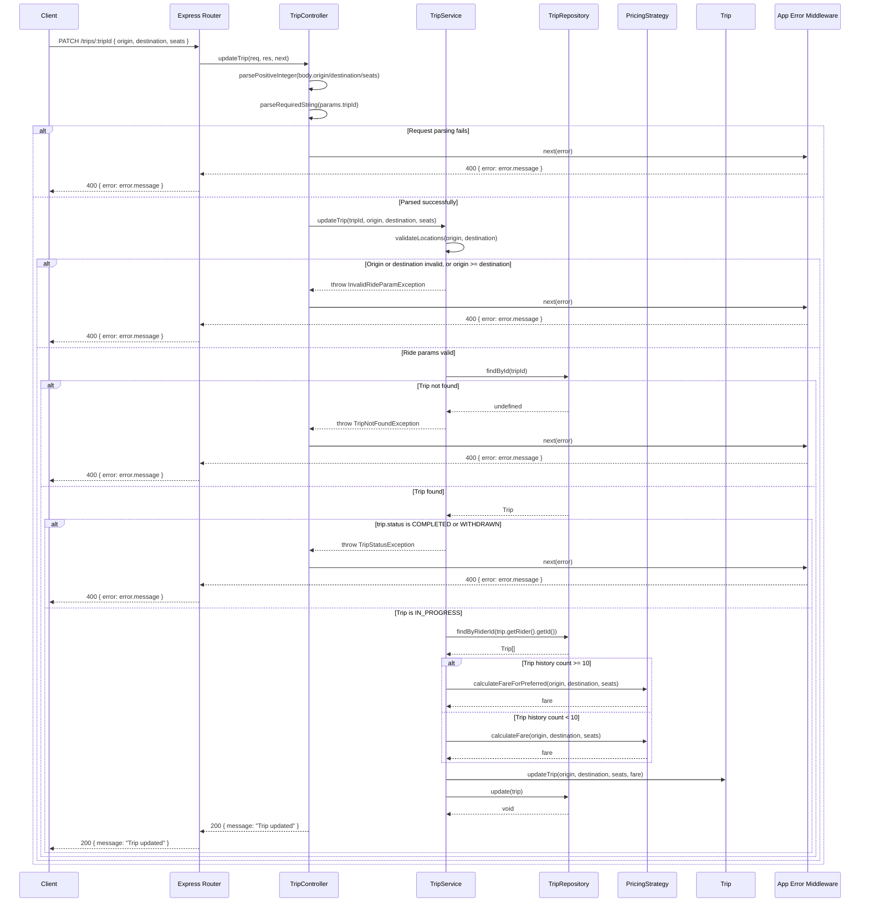
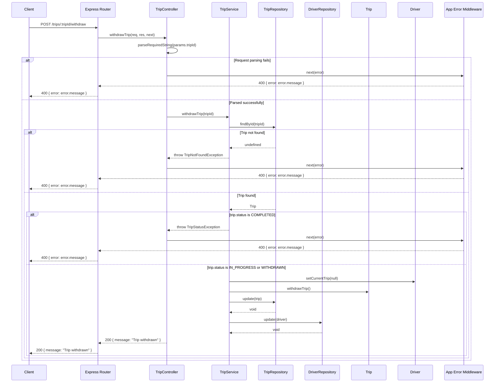
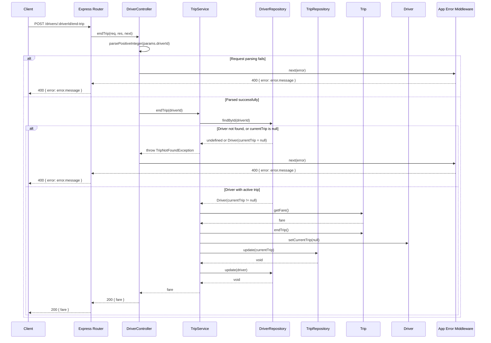

## Create Trip

```mermaid
sequenceDiagram
    participant Client
    participant Express as Express Router
    participant Controller as TripController
    participant Service as TripService
    participant RiderRepo as RiderRepository
    participant DriverRepo as DriverRepository
    participant TripRepo as TripRepository
    participant Matching as DriverMatchingStrategy
    participant Pricing as PricingStrategy
    participant Trip
    participant Driver
    participant Error as App Error Middleware

    Client->>Express: POST /trips { riderId, origin, destination, seats }
    Express->>Controller: createTrip(req, res, next)
    Controller->>Controller: parsePositiveInteger(body.riderId/origin/destination/seats)

    alt Request parsing fails
        Controller->>Error: next(error)
        Error-->>Express: 400 { error: error.message }
        Express-->>Client: 400 { error: error.message }
    else Parsed successfully
        Controller->>Service: createTrip(riderId, origin, destination, seats)
        Service->>Service: validateLocations(origin, destination)

        alt Origin or destination invalid, or origin >= destination
            Service-->>Controller: throw InvalidRideParamException
            Controller->>Error: next(error)
            Error-->>Express: 400 { error: error.message }
            Express-->>Client: 400 { error: error.message }
        else Ride params valid
            Service->>RiderRepo: findById(riderId)

            alt Rider not found
                RiderRepo-->>Service: undefined
                Service-->>Controller: throw TripNotFoundException
                Controller->>Error: next(error)
                Error-->>Express: 400 { error: error.message }
                Express-->>Client: 400 { error: error.message }
            else Rider found
                RiderRepo-->>Service: Rider
                Service->>DriverRepo: findAll()
                DriverRepo-->>Service: Driver[]
                Service->>Service: filter drivers with driver.isAvailable()
                Service->>Matching: findDriver(rider, availableDrivers, origin, destination)

                alt No driver selected
                    Matching-->>Service: undefined
                    Service-->>Controller: throw DriverNotFoundException
                    Controller->>Error: next(error)
                    Error-->>Express: 400 { error: error.message }
                    Express-->>Client: 400 { error: error.message }
                else Driver selected
                    Matching-->>Service: Driver
                    Service->>TripRepo: findByRiderId(riderId)
                    TripRepo-->>Service: Trip[]

                    alt Trip history count >= 10
                        Service->>Pricing: calculateFareForPreferred(origin, destination, seats)
                        Pricing-->>Service: fare
                    else Trip history count < 10
                        Service->>Pricing: calculateFare(origin, destination, seats)
                        Pricing-->>Service: fare
                    end

                    Service->>Trip: new Trip(rider, driver, origin, destination, seats, fare)
                    Service->>TripRepo: save(riderId, trip)
                    TripRepo-->>Service: void
                    Service->>Driver: setCurrentTrip(trip)
                    Service->>DriverRepo: update(driver)
                    DriverRepo-->>Service: void
                    Service-->>Controller: tripId
                    Controller-->>Express: 201 { tripId }
                    Express-->>Client: 201 { tripId }
                end
            end
        end
    end
```

## Update Trip

```mermaid
sequenceDiagram
    participant Client
    participant Express as Express Router
    participant Controller as TripController
    participant Service as TripService
    participant TripRepo as TripRepository
    participant Pricing as PricingStrategy
    participant Trip
    participant Error as App Error Middleware

    Client->>Express: PATCH /trips/:tripId { origin, destination, seats }
    Express->>Controller: updateTrip(req, res, next)
    Controller->>Controller: parsePositiveInteger(body.origin/destination/seats)
    Controller->>Controller: parseRequiredString(params.tripId)

    alt Request parsing fails
        Controller->>Error: next(error)
        Error-->>Express: 400 { error: error.message }
        Express-->>Client: 400 { error: error.message }
    else Parsed successfully
        Controller->>Service: updateTrip(tripId, origin, destination, seats)
        Service->>Service: validateLocations(origin, destination)

        alt Origin or destination invalid, or origin >= destination
            Service-->>Controller: throw InvalidRideParamException
            Controller->>Error: next(error)
            Error-->>Express: 400 { error: error.message }
            Express-->>Client: 400 { error: error.message }
        else Ride params valid
            Service->>TripRepo: findById(tripId)

            alt Trip not found
                TripRepo-->>Service: undefined
                Service-->>Controller: throw TripNotFoundException
                Controller->>Error: next(error)
                Error-->>Express: 400 { error: error.message }
                Express-->>Client: 400 { error: error.message }
            else Trip found
                TripRepo-->>Service: Trip

                alt trip.status is COMPLETED or WITHDRAWN
                    Service-->>Controller: throw TripStatusException
                    Controller->>Error: next(error)
                    Error-->>Express: 400 { error: error.message }
                    Express-->>Client: 400 { error: error.message }
                else Trip is IN_PROGRESS
                    Service->>TripRepo: findByRiderId(trip.getRider().getId())
                    TripRepo-->>Service: Trip[]

                    alt Trip history count >= 10
                        Service->>Pricing: calculateFareForPreferred(origin, destination, seats)
                        Pricing-->>Service: fare
                    else Trip history count < 10
                        Service->>Pricing: calculateFare(origin, destination, seats)
                        Pricing-->>Service: fare
                    end

                    Service->>Trip: updateTrip(origin, destination, seats, fare)
                    Service->>TripRepo: update(trip)
                    TripRepo-->>Service: void
                    Controller-->>Express: 200 { message: "Trip updated" }
                    Express-->>Client: 200 { message: "Trip updated" }
                end
            end
        end
    end
```

## Withdraw Trip

```mermaid
sequenceDiagram
    participant Client
    participant Express as Express Router
    participant Controller as TripController
    participant Service as TripService
    participant TripRepo as TripRepository
    participant DriverRepo as DriverRepository
    participant Trip
    participant Driver
    participant Error as App Error Middleware

    Client->>Express: POST /trips/:tripId/withdraw
    Express->>Controller: withdrawTrip(req, res, next)
    Controller->>Controller: parseRequiredString(params.tripId)

    alt Request parsing fails
        Controller->>Error: next(error)
        Error-->>Express: 400 { error: error.message }
        Express-->>Client: 400 { error: error.message }
    else Parsed successfully
        Controller->>Service: withdrawTrip(tripId)
        Service->>TripRepo: findById(tripId)

        alt Trip not found
            TripRepo-->>Service: undefined
            Service-->>Controller: throw TripNotFoundException
            Controller->>Error: next(error)
            Error-->>Express: 400 { error: error.message }
            Express-->>Client: 400 { error: error.message }
        else Trip found
            TripRepo-->>Service: Trip

            alt trip.status is COMPLETED
                Service-->>Controller: throw TripStatusException
                Controller->>Error: next(error)
                Error-->>Express: 400 { error: error.message }
                Express-->>Client: 400 { error: error.message }
            else trip.status is IN_PROGRESS or WITHDRAWN
                Service->>Driver: setCurrentTrip(null)
                Service->>Trip: withdrawTrip()
                Service->>TripRepo: update(trip)
                TripRepo-->>Service: void
                Service->>DriverRepo: update(driver)
                DriverRepo-->>Service: void
                Controller-->>Express: 200 { message: "Trip withdrawn" }
                Express-->>Client: 200 { message: "Trip withdrawn" }
            end
        end
    end
```

## End Trip

```mermaid
sequenceDiagram
    participant Client
    participant Express as Express Router
    participant Controller as DriverController
    participant Service as TripService
    participant DriverRepo as DriverRepository
    participant TripRepo as TripRepository
    participant Trip
    participant Driver
    participant Error as App Error Middleware

    Client->>Express: POST /drivers/:driverId/end-trip
    Express->>Controller: endTrip(req, res, next)
    Controller->>Controller: parsePositiveInteger(params.driverId)

    alt Request parsing fails
        Controller->>Error: next(error)
        Error-->>Express: 400 { error: error.message }
        Express-->>Client: 400 { error: error.message }
    else Parsed successfully
        Controller->>Service: endTrip(driverId)
        Service->>DriverRepo: findById(driverId)

        alt Driver not found, or currentTrip is null
            DriverRepo-->>Service: undefined or Driver(currentTrip = null)
            Service-->>Controller: throw TripNotFoundException
            Controller->>Error: next(error)
            Error-->>Express: 400 { error: error.message }
            Express-->>Client: 400 { error: error.message }
        else Driver with active trip
            DriverRepo-->>Service: Driver(currentTrip != null)
            Service->>Trip: getFare()
            Trip-->>Service: fare
            Service->>Trip: endTrip()
            Service->>Driver: setCurrentTrip(null)
            Service->>TripRepo: update(currentTrip)
            TripRepo-->>Service: void
            Service->>DriverRepo: update(driver)
            DriverRepo-->>Service: void
            Service-->>Controller: fare
            Controller-->>Express: 200 { fare }
            Express-->>Client: 200 { fare }
        end
    end
```
